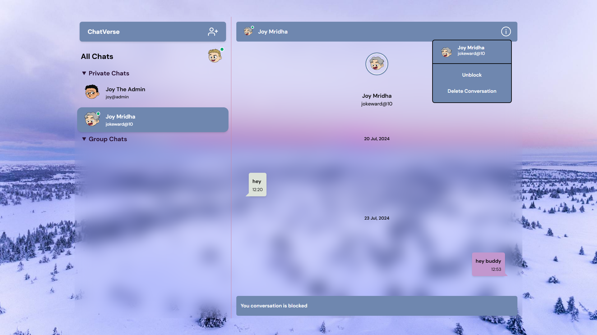
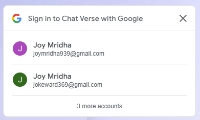

# Chat Verse

## Table of Contents

- [Chat Verse](#chat-verse)
  - [Table of Contents](#table-of-contents)
  - [Introdution](#introdution)
  - [Features](#features)
  - [Tech Stack](#tech-stack)
    - [FrontEnd](#frontend)
    - [BackEnd](#backend)
    - [Database](#database)
    - [Bundler](#bundler)
    - [Deployment](#deployment)
  - [Installation](#installation)
  - [Usage](#usage)
  - [Visuals](#visuals)
    - [Register Page](#register-page)
    - [Login Page](#login-page)
    - [Home Page](#home-page)
    - [Private Chat](#private-chat)
    - [Group Chat](#group-chat)
    - [Profile Popup](#profile-popup)
    - [Add New User](#add-new-user)
    - [Add New Group](#add-new-group)
    - [Unread Status and Notification Popup](#unread-status-and-notification-popup)
    - [Block User](#block-user)
    - [Google One Tap Sign In](#google-one-tap-sign-in)
    - [Admin UI](#admin-ui)
  - [Author](#author)
  - [Color Pallete](#color-pallete)
  - [Updates](#updates)
    - [🎉 July 23, 2024 - Enhanced Real-Time Group Chat Features Added! 🎉](#-july-23-2024---enhanced-real-time-group-chat-features-added-)

## Introdution

`Chat Verse` is a robust real-time communication platform built on `Express.js`, `MongoDB`, and `Socket.io`. This versatile application offers both individual and group chat functionalities, featuring multi-method user authentication, real-time messaging, and comprehensive group management tools. Users can create groups, share invitation links, and manage their messages, while enjoying features like user search, profile customization, and online status indicators. Chat Verse prioritizes security with measures such as CSRF protection, CORS, and rate limiting.

Its MVC architecture and modular design ensure scalability, while an integrated Socket.io admin UI aids in real-time connection management. Whether for personal or professional use, Chat Verse provides a secure, feature-rich environment for seamless real-time communication.

## Features

- **Real-time chat (with Socket.io)**
    1. Send Message
    2. Receive Message
    3. Delete Message (For Both)
    4. Delete Conversation (For Both)
    5. Block & Unblock user
    6. Unread message status
- **Group Chat Functionality**
    1. Create new group chats
    2. Send and receive messages in group chats in real-time
    3. Delete your own messages in group chats
    4. Join groups via invitation links
    5. Leave groups (group remains for other members)
    6. View group member list
- Real-time notifications for private and group chats
- Real-time user online status
- Real-time other user's changed details reflection
- User profile (With exciting avatars)
- User search
- **User authentication**
    1. JWT
    2. Google
    3. Google One Tap SignIn
- CSRF
- XSS
- CORS
- Rate limiting
- Session Management
- Cookie Management
- Cache Control
- Admin UI (Socket.io)

## Tech Stack

### FrontEnd

- HTML
- EJS
- TailwindCSS
- JavaScript
- Socket.io Client

### BackEnd

- Node.js
- Express.js
- Express Session
- Express Rate Limiting
- Socket.io
- PassportJS
- JWT
- Google OAuth
- Google One Tap SignIn
- CSRF
- CORS
- Helmet

### Database

- MongoDB
- Mongoose

### Bundler

- Webpack

### Deployment

- [Chat Verse](https://chat-verse.glitch.me/chat) deployed on Glitch
- [Chat Verse](https://chat-verse.up.railway.app/) deployed on Railway

## Installation

1. Clone the repository

    ```bash
    git clone https://github.com/Joy9001/Chat-Verse.git
    ```

2. Install dependencies

    ```bash
    npm install
    ```

3. Create a `.env` file in the root directory and add the following environment variables

    ```env
    PORT=3001
    DOMAIN=http://localhost:3001
    MONGODB_URI=mongodb://localhost:27017/chat-app (Add a Atlas Cluster URL)
    NODE_ENV=production
    SESSION_SECRET=your_session_secret
    ACCESS_TOKEN_SECRET=your_access_token_secret
    REFRESH_TOKEN_SECRET=your_refresh_token_secret
    CRYPTO_SECRET=your_crypto_secret
    ADMIN_EMAIL=your_email
    ADMIN_HASHED_PASSWORD=your_hashed_password
    GOOGLE_CLIENT_ID=your_google_client_id
    GOOGLE_CLIENT_SECRET=your_google_client_secret
    GOOGLE_CALLBACK_URL=http://localhost:3001/auth/google/callback
    GOOGLE_ONE_TAP_CALLBACK_URL=http://localhost:3001/auth/google/one-tap/callback
    ```

4. Start the server

    ```bash
    npm start
    ```

5. Open the browser and go to `http://localhost:3001`

## Usage

1. Register a new account or login using your preferred authentication method
2. Explore the user search to find and connect with other users
3. Start one-on-one chats or create group conversations
4. Join existing groups using invitation links
5. Send and receive messages in real-time, with the ability to delete your own messages in group chats
6. Manage your group memberships by viewing member lists or leaving groups as needed
7. Customize your profile and choose from a variety of avatars
8. Stay informed with online status indicators and unread message notifications
9. Enjoy secure, real-time communication in both individual and group settings

## Visuals

### Register Page


### Login Page


### Home Page


### Private Chat


### Group Chat


### Profile Popup


### Add New User


### Add New Group


### Unread Status and Notification Popup


### Block User

- Blocked User

    

- Blocked by User

    

### Google One Tap Sign In



### Admin UI


## Author

This project is developed by [Joy Mridha](https://github.com/Joy9001).

## Color Pallete

-  `#6f87af`
-  `#ce83a3`
-  `#dde3da`
-  `#c297ce`
-  `#ffffff`
-  `#000000`

## Updates

### 🎉 July 23, 2024 - Enhanced Real-Time Group Chat Features Added! 🎉

I'm thrilled to announce the launch of the brand-new Group Chat functionality in Chat Verse! 🚀

🔥 **New Real-Time Features:**

- 👥 Create Group Chats: Bring your squad together in one place!
- 💬 Group Messaging: Chat with everyone in real-time!
- 🗑️ Message Management: Oops? Delete your messages anytime!
- 🔗 Join via Link: Hop into new groups with just a click!
- 👋 Leave Groups: Step out anytime, messages intact! Last one out turns off the lights!
- 📊 Group Information: Keep tabs on who's in the crew!
- ⚡ Real-Time Updates: See messages pop up as they're sent!
- 🔔 Instant Notifications: Stay in the loop with group activities!
- 💫 Updated UI: A fresh look for a seamless group chat experience!

🕵️‍♂️ **Easter Egg Alert!**
I've hidden a little surprise for the curious minds out there. Try to chat with yourself and see what happens! Who knows, you might stumble upon some programmer humor. Happy hunting!

✨ All these features operate in real-time, ensuring that every member of a group chat has the most up-to-date information and can engage in fluid, dynamic conversations.

🚀 These enhancements provide a more robust, responsive, and interactive group chatting experience, allowing for seamless collaboration and communication among multiple users simultaneously.

📌 **How to Get Started:**

- To create a new group, look for the `New Group` tab in the `Add User` section.
- To join an existing group, use the invitation link provided by a group member.

I'm constantly working to improve Chat Verse and welcome your feedback on these new real-time group chat features! 💌

**Happy Chatting!** 🎈🎊
